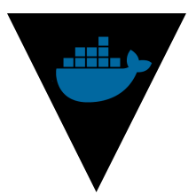

# Docker Credential Helper for Vault-stored Credentials



[](https://ci.morningconsultintelligence.com/teams/oss/pipelines/docker-credential-vault-login)

This program is a [Docker credential helper](https://github.com/docker/docker-credential-helpers) for the Docker daemon. When you run `docker pull` it automatically authenticates against your [Vault](https://www.vaultproject.io/) server, fetches your Docker credentials, and uses those credentials to log in to your Docker registry before pulling the Docker image.

This program leverages much of the [Vault agent](https://www.vaultproject.io/docs/agent/) code for authentication. As such, it requires the same [configuration file](https://www.vaultproject.io/docs/agent/autoauth/index.html) as the Vault agent (see the [configuration file](#configuration-file) section for more information). Furthermore, it supports all of the authentication methods currently supported by the Vault agent, including:

* Alibaba Cloud (AliCloud)
* Vault AppRole
* Amazon Web Services (AWS)
* Microsoft Azure
* Google Cloud Platform (GCP)
* JSON Web Tokens (JWT)
* Kubernetes

## Prerequisites

You must have Docker (version 1.11 or newer) and Go (version **1.11.3** or newer) installed on your system.

You must also have an operational instance of Vault (version 0.10 or newer).

Within Vault, you should store your Docker credentials in the following format:
```json
{
    "username": "docker@registry.user",
    "password": "my-secure-password"
}
```
Note that the Vault path where you store these credentials will be used as the value of the `auto_auth.method.config.secret` field of your `config.hcl` file (see the [Configuration File](#configuration-file) section).

## Installation

### Manually

You can download your preferred variant of the binary from the [releases page](https://github.com/morningconsult/docker-credential-vault-login/releases).

### Using `go get`

You can install this via `go get` with:
```bash
$ go get -u github.com/morningconsult/docker-credential-vault-login
```

Once finished, the binary `docker-credential-vault-login` will be in `$GOPATH/bin`.

### Using Docker

If you do not have Go installed locally, you can still build the binary if you have Docker installed. Simply clone this repository and run `make docker` to build the binary within the Docker container and output it to the local directory.

You can cross-compile the binary using the `TARGET_GOOS` and `TARGET_GOARCH` environment variables. For example, if you wish to compile the binary for a 64-bit (x86-64) Windows machine, run the following command:

```shell
$ TARGET_GOOS="windows" TARGET_GOARCH="amd64" make docker
```

The binary will be output to `bin` of the local directory.

## Setup

### Docker configuration

Once you have the `docker-credential-vault-login` binary, place it in a location on your `PATH` and set the contents of your `~/.docker/config.json` file to be:

```json
{
    "credsStore": "vault-login"
}
```

This configures the Docker daemon to use the credential helper for all registries.

With Docker 1.13.0 or greater, you can configure Docker to use different credential helpers for different registries. To use this credential helper for a specific registry, create a credHelpers section with the URI of your registry:

```json
{
    "credHelpers": {
        "my.docker.registry.com": "vault-login"
    }
}
```

## Configuration File

This application requires a configuration file in order to determine which authentication method to use and how, if at all, your tokens should be cached. At runtime, the process will first search for this file at the path specified by `DCVL_CONFIG_FILE` environmental variable. If this environmental variable is not set, it will search for it at the default path `/etc/docker-credential-vault-login/config.hcl`. If the configuration file is found in neither location, the process will fail.

This configuration file must conform to the same specifications as the [Vault agent configuration file](https://www.vaultproject.io/docs/agent/autoauth/index.html) in addition to some application-specific parameters:

- **`auto_auth` stanza only**. Of the various top-level elements that can be included in the file (e.g. `pid_file`, `exit_after_auth`, and `auto_auth`), only the [`auto_auth`](https://www.vaultproject.io/docs/agent/autoauth/index.html) field is required. 
- **`token` authentication method**. In addition to the [authentication methods](https://www.vaultproject.io/docs/agent/autoauth/methods/index.html) supported by the Vault agent (e.g. `aws`, `gcp`, `alicloud`, etc.), a `token` method is also supported which allows you to bypass authentication by manually providing a valid Vault client token. See the (Token Authentication)[#token-authentication] section for more information
- **Docker credentials secret**. The path to the secret where you keep your Docker credentials in Vault (see the [Prequisites](#prerequisites) section) must be specified either in the configuration file or by an environment variable (see the [Secret Path](#secret-path) section).
- **Diffie-Hellman private key**. As mentioned in [sink](https://www.vaultproject.io/docs/agent/autoauth/index.html#configuration-sinks-) section the Vault agent documentation, a Diffie-Hellman public key must be provided if you wish to encrypt tokens. However, in order to decrypt those tokens for future use, you must also provide the Diffie-Hellman private key either in the configuration file or by an environment variable (see the [Diffie-Hellman Private Key](#diffie-hellman-private-key) section).

### Secret Path

The `auto_auth.method.config` field of the configuration file must contain the key `secret` whose value is the path to the secret where your Docker credentials are kept in your Vault server. This can also be specified with the `DCVL_SECRET` environment variable. The environment variable takes precedence.

### Diffie-Hellman Private Key

If a cached token is [encrypted](https://www.vaultproject.io/docs/agent/autoauth/index.html#encrypting-tokens), the `auto_auth.sink.config` field must contain the key `dh_priv` whose value is the path to a file containing your Diffie-Hellman private key with which the application will decrypt the token. This file should be a JSON file structured like the one shown below:

```json
{
    "curve25519_private_key": "NXAnojBsGvT9UMkLPssHdrqEOoqxBFV+c3Bf9YP8VcM="
}
```

The private key can also be specified with the `DCVL_DH_PRIV_KEY` environment variable. Using the JSON above as an example, you can set the private key with the environment variable by running the following command:

```shell
$ export DCVL_DH_PRIV_KEY="NXAnojBsGvT9UMkLPssHdrqEOoqxBFV+c3Bf9YP8VcM="
```

 The environment variable takes precedence.

**Note**: You can generate a Diffie-Hellman public-private key pair with the [script](https://github.com/morningconsult/docker-credential-vault-login/blob/master/scripts/generate-dh-keys.sh) provided in this repository.

### Example

The configuration file shown in this example is based on an [example](https://www.vaultproject.io/docs/agent/index.html#example-configuration) provided in the Vault documentation:

```hcl
auto_auth {
	method "aws" {
		mount_path = "auth/aws"
		config = {
			type   = "iam"
			role   = "foobar"
			secret = "secret/application/docker"
		}
	}

	sink "file" {
		config = {
			path = "/tmp/file-foo"
		}
	}

	sink "file" {
		wrap_ttl = "5m" 
		aad_env_var = "TEST_AAD_ENV"
		dh_type = "curve25519"
		dh_path = "/tmp/dh-pub-key.json"
		config = {
			path    = "/tmp/file-bar.json"
			dh_priv = "/tmp/dh-priv-key.json"
		}
	}
}
```

**Note**: The Diffie-Hellman public and private key files (`dh_path` and `dh_priv` fields) can be generated by executing [this](https://github.com/morningconsult/docker-credential-vault-login/blob/master/scripts/generate-dh-keys.sh) script provided in the repository.

Using this configuration file, the application will perform the following when you run `docker pull`:

1. **Read all cached tokens.** Specifically, the process will read `/tmp/file-foo`, expecting this file to contain a plaintext token. Then, it will read `/tmp/file-bar.json`, decrypt it using the Diffie-Hellman public-private key pair (`/tmp/dh-pub-key.json` and `/tmp/dh-priv-key.json` respectively), and [unwrap](https://www.vaultproject.io/docs/concepts/response-wrapping.html) it to obtain a usable client token.
2. **Use a cached token to read the secret.** If any of the cached tokens were successfully read, the process will try each one to attempt to read your Docker credentials from Vault at the path `secret/application/docker` until it successfully reads the secret.
3. **Re-authenticate if all cached tokens failed.** If the process was unable to read the secret using any of the cached tokens, it will authenticate against your Vault instance via the [AWS IAM](https://www.vaultproject.io/docs/auth/aws.html#iam-auth-method) endpoint using the `foobar` role to obtain a new Vault client token.
4. **Use the new token to read the secret.** If authentication was successful, the process will use the newly-obtained token to read your Docker credentials at `secret/application/docker`.
5. **Cache the new token.** If authentication was successful, the process will also cache the token as plaintext in a file called `/tmp/file-foo` and encrypt and cache the token in another file called `/tmp/file-bar.json`.

## Vault Client Configuration

The behavior of the Vault client can be specified using the Vault [environment variables](https://www.vaultproject.io/docs/commands/index.html#environment-variables). They can also be specified in the `auto_auth.method.config` field like in the HCL shown below:

```hcl
auto_auth {
	method "aws" {
		mount_path = "auth/aws"
		config = {
			type              = "iam"
			role              = "foobar"
			secret            = "secret/application/docker"
			vault_addr        = "http://vault.service.consul"
			vault_cacert      = "/tmp/ca-cert.pem"
			vault_client_cert = "/tmp/client-cert.pem"
			vault_client_key  = "/tmp/client-key.pem"
		}
	}

	sink "file" {
		config = {
			path = "/tmp/file-foo"
		}
	}
}
```

The keys in the `auto_auth.method.config` section used to configure the Vault client are the same as their respective environment variables. The environment variables take precedence.

### Token Authentication

You may also manually provide a Vault client token to bypass authentication altogether. To do so, you must use `token` authentication method in your configuration file. You can provide the token in the `auto_auth.method.config.token` field of the configuration file or by setting the token with the `VAULT_TOKEN` environment variable. See the examples below.

#### Example 1: Token set in configuration file

You can set the token in the `auto_auth.method.config.token` field.

```hcl
auto_auth {
	method "token" {
		mount_path = "auth/token"
		config     = {
			secret = "secret/application/docker"
			token  = "8efc06ef-ced9-170f-9f66-c94740a61c93"
		}
	}

	sink "file" {
		config = {
			path = "/tmp/file-foo"
		}
	}
}
```

#### Example 2: Token set in environment

You can also set the token in `VAULT_TOKEN` environment variable.

```shell
$ export VAULT_TOKEN="8efc06ef-ced9-170f-9f66-c94740a61c93"
```

If you've set your token in the environment, you do not need to provide it in the configuration file.

```hcl
auto_auth {
	method "token" {
		mount_path = "auth/token"
		config     = {
			secret = "secret/application/docker"
		}
	}

	sink "file" {
		config = {
			path = "/tmp/file-foo"
		}
	}
}
```

## Frequently-Asked Questions

#### Must I always have at least one sink in my configuration file (even if I am using the token authentication method)?

Yes, you must always have at least one sink in your configuration file. This is simply due to the design of the Vault agent code. However, if you disable caching by setting the `DCVL_DISABLE_CACHE` environment variable to `true` then the process will not actually cache any tokens, regardless of the sinks specified in your configuration file.

## Usage

### EC2 Authentication Method

If the `ec2` authentication is chosen, the process will attempt to authenticate against Vault using Vault's [EC2 auth method](https://www.vaultproject.io/docs/auth/aws.html#ec2-auth-method). Specifically, it will attempt to obtain the PKCS#7 signature from the EC2 instance metadata and authenticate against Vault with it. Be sure that the instance on which this application will run is indeed an EC2 instance and that the Vault role given in the `role` field of the `config.hcl` file is bound to the AMI ID of the instance and that it has permission to authenticate via the EC2 method (see this [example](https://www.vaultproject.io/docs/auth/aws.html#configure-the-policies-on-the-role-)). 

### IAM Authentication Method

If the `iam` method of authentication is chosen, the process will attempt to authenticate against Vault using Vault's [IAM auth method](https://www.vaultproject.io/docs/auth/aws.html#iam-auth-method). As such, it will require IAM credentials. You also have AWS credentials available in one of the standard locations:
* The `~/.aws/credentials` file
* The `AWS_ACCESS_KEY_ID` and `AWS_SECRET_ACCESS_KEY` environment variables
* An [IAM role for Amazon EC2](http://docs.aws.amazon.com/AWSEC2/latest/UserGuide/iam-roles-for-amazon-ec2.html)

### Environmental Variables

There are also a few optional application-specific environment variables which configure the its behavior:
* **DOCKER_CREDS_CONFIG_FILE** (default: `"/etc/docker-credential-vault-login/config.json"`) - The path to your `config.json` file.
* **DOCKER_CREDS_CACHE_DIR** (default: `"~/.docker-credential-vault-login"`) - The location at which error logs and cached tokens (if caching is enabled) will be stored.
* **DOCKER_CREDS_DISABLE_CACHE** (default: `"false"`) - If `true`, the application will not cache Vault client tokens. Tokens are cached at the `tokens` subfolder of the directory given by the `DOCKER_CREDS_CONFIG_FILE` environment variable (if set), and at `~/.docker-credential-vault-login/tokens.json` if not set.

## Error Logs

All error logs will be output to `~/.docker-credential-vault-login/log/vault-login.log` by default. If you wish to store logs in a different directory, you can specify the desired directory with the `DOCKER_CREDS_CACHE_DIR` environmental variable.